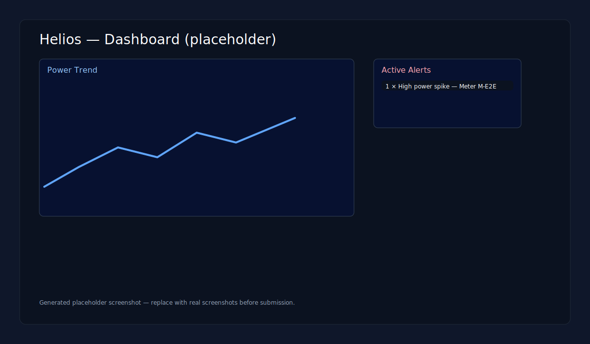
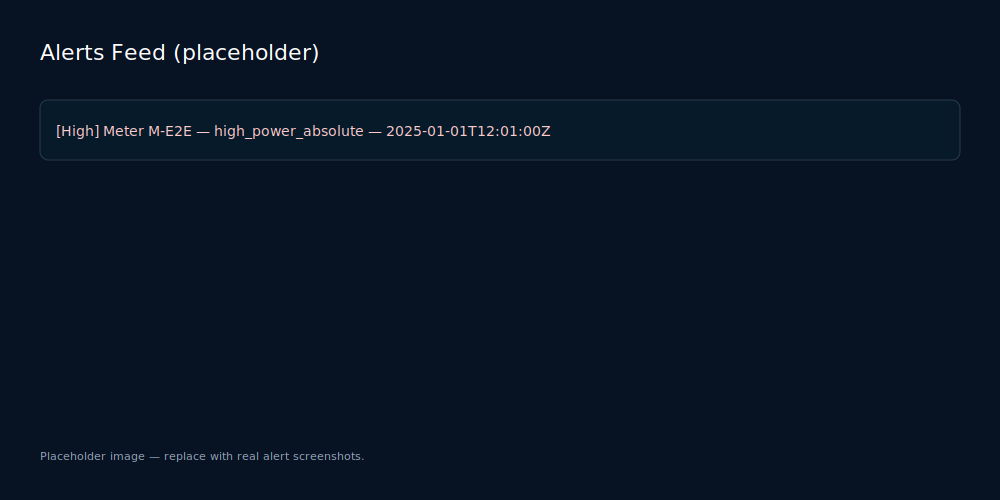

# Helios — Intelligent Energy Monitoring

Helios is a modern energy-monitoring platform that detects anomalies in meter readings, surfaces realtime alerts, and provides a polished dashboard for operators and stakeholders.

**Pitch:** Bright insights, fewer outages — Helios turns noisy meter data into actionable alerts and clear operational dashboards. Ideal for utilities and grid operators who need fast detection and rich visualizations.

## Problem

Many operators cannot reliably detect and investigate anomalous energy consumption patterns in real time. Alerts are noisy, triage is manual, and correlating events across meters and zones is time-consuming.

## Solution

Helios ingests meter readings, applies rule-based and ML-assisted anomaly detection, and presents prioritized alerts and geospatial visualizations so teams can respond faster and reduce downtime.

Key capabilities:
- Realtime alerting via WebSocket and REST API
- Geospatial zone and hotspot visualizations with heatmap overlays
- Drill-down analytics per zone and meter (usage, anomalies, top meters)
- Demo mode with synthetic data for quick demos or hackathons

## Architecture

- Backend: FastAPI, SQLAlchemy, Uvicorn
	- Database: PostgreSQL recommended (SQLite fallback for local dev)
	- Realtime: WebSocket endpoint (`/ws/live`) for push alerts and readings
	- ML: pluggable detection engine (simple rules + optional ML model)
- Frontend: Next.js (App Router), TypeScript, Tailwind CSS, Recharts, Leaflet (maps)
- Dev infra: Docker Compose for quick local stacks (Postgres + Redis + services)

Diagram (high level):

- Meter -> Ingest API -> DB -> Detection Engine -> Alerts -> Web UI / WebSocket

## Features

- Meter ingestion and historical reading storage
- Rule-based and ML-assisted anomaly detection
- Realtime alerts stream (WS) and REST endpoints
- Interactive dashboard: KPIs, trend charts, alert feed
- Geospatial heatmap, zones and hotspot overlays
- Drill-down analytics and top-meters per zone
- Demo mode (simulated data + live demo emitter)
- Docker + local development support

## Demo & Presentation Steps

Quick demo (Docker):

```bash
# Build and start services
docker compose up --build

# Optional: seed demo data
docker compose exec backend python scripts/seed.py
```

Local one-command demo (no Docker):

PowerShell:

```powershell
.\run-demo.ps1
```

Bash / macOS / WSL:

```bash
./run-demo.sh
```

Local dev (frontend only):

```bash
npm run setup
NEXT_PUBLIC_API_URL=http://localhost:8000 npm run dev
```

The root `package.json` forwards commands to `frontend/`, so running `npm run dev` from the repository root now starts the Helios frontend instead of any unrelated parent-level npm project.

Demo Mode (fast demo without backend):

1. Open the dashboard at `http://localhost:3000`.
2. Toggle the **Demo** control in the top-right of the dashboard header to ON.
	 - The toggle persists to `localStorage['helios.demo']` and automatically starts an in-browser demo engine that emits synthetic readings and alerts.
3. Watch the Live Feed, Heatmap, and KPIs update in real time — ideal for presentations or hackathons.

Alternative (manual):

```js
// enable demo mode in the browser console
localStorage.setItem('helios.demo', '1')
window.location.reload()
```

## Hackathon Quick Start — one command

PowerShell (Windows):

```powershell
.\hackathon_setup.ps1
```

macOS / Linux / WSL:

```bash
./hackathon_setup.sh
```

What the script does:
- Creates a Python virtualenv at `backend/.venv` (if missing)
- Installs backend Python dependencies from `backend/requirements.txt`
- Installs frontend packages (`npm ci` in `frontend`) if `npm` is available
- Runs the demo seeder: `backend/scripts/seed.py --fast`

Demo video

- Watch a short walkthrough here: https://youtu.be/REPLACE_WITH_YOUR_VIDEO

## How to Capture Screenshots for Slides

Replace the placeholder images in the `docs/screenshots/` folder with real captures.




_Tip:_ Use 1366×768 or 1920×1080 for presentation-ready screenshots.

## Useful Endpoints

- Health: `GET /health`
- API base: `/api/v1`
- Alerts: `GET /api/v1/alerts`
- Readings by meter: `GET /api/v1/readings/by-meter/{meter_id}`
- WebSocket: `ws://<host>/ws/live`

## Pitch (Short)

Helios: Cut noise, find risk — a realtime energy intelligence platform that gets teams from data to action in minutes.

## Contributing

Contributions are welcome. Open issues or PRs for feature requests, bug fixes or documentation improvements. For demo-mode improvements, see `frontend/lib/demo.ts`.

## Deployment

Quick deployment checklist and notes:

- **Environment:** Set `ENV=production` (or `HELIOS_ENV=production`) when running in production.
- **Critical env vars:** `DATABASE_URL` (must be a production database, not sqlite), `JWT_SECRET` (at least 16 chars), `REDIS_URL` (optional), and `CORS_ALLOWED_ORIGINS`.
- **Migrations:** If you changed models (indexes or schema), generate and apply Alembic migrations before deploying:

```bash
cd backend
# create a new revision then apply it
alembic revision --autogenerate -m "describe changes"
alembic upgrade head
```

- **Build & run (Docker):**

```bash
cd backend
docker build -t helios-backend .
docker run -e ENV=production -e DATABASE_URL="postgresql://user:pass@db:5432/helios" -e JWT_SECRET="<strong-secret>" -p 8000:8000 helios-backend
```

- **Notes:** The backend validates critical settings at startup and will refuse to start in `production` without a valid `DATABASE_URL` and `JWT_SECRET` to avoid accidental insecure deployments.

## License

This project is provided under an open-source license — add your chosen license file to the repo.
