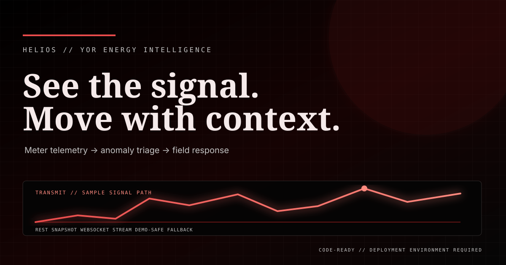
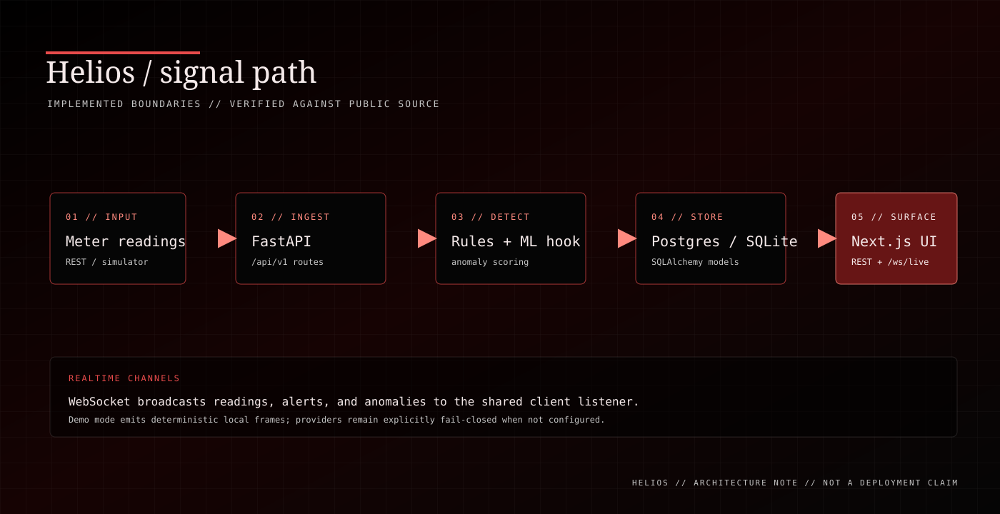
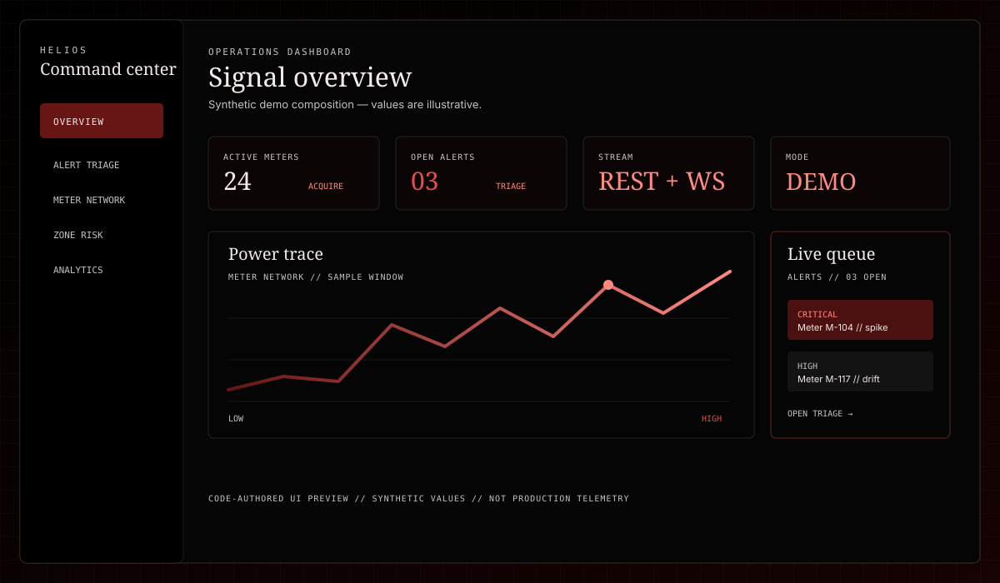
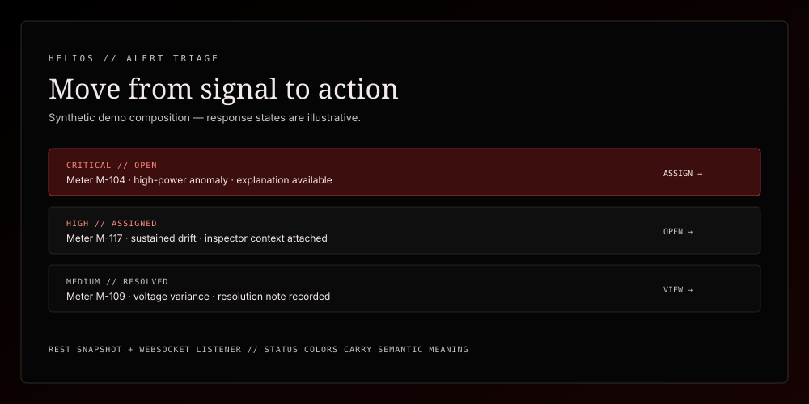
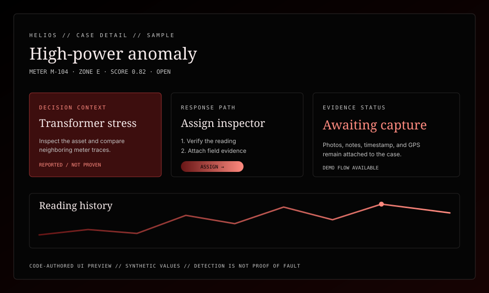
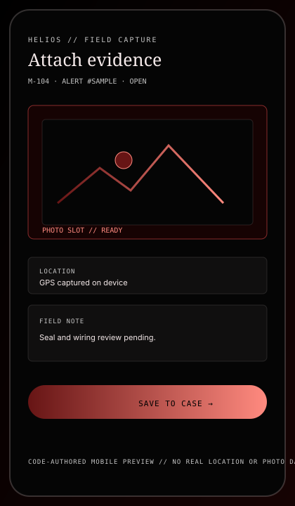

# Helios // Energy Intelligence

> **STATUS: DEMO / EXPERIMENTAL** — Helios is a code-ready operator surface for meter telemetry, anomaly triage, and field response. The repository includes a deterministic browser demo; a hosted deployment is not claimed.

Helios makes the path from a suspicious meter signal to an actionable response legible: ingest a reading, score an anomaly, persist the case, broadcast the update, and give an operator enough context to investigate. The interface is intentionally built as a command surface rather than a generic analytics dashboard.



## What is implemented

- FastAPI REST routes under `/api/v1` for auth, meters, readings, alerts, anomalies, zones, dashboard summaries, recommendations, and sync actions.
- A WebSocket channel at `/ws/live` for reading, alert, and anomaly frames.
- Next.js App Router frontend with dashboard, alert triage, meter, zone, and analytics views.
- Deterministic local demo mode that emits synthetic frames without requiring a live backend.
- Responsive YOR visual system with a reduced-motion alternative, visible status vocabulary, and semantic severity colors.
- PostgreSQL-first backend configuration with SQLite available for local development; Redis is optional for realtime support.

The demo surface is useful for reviewing navigation, layout, and client-side signal handling. It does not turn synthetic events into evidence of real grid behavior.

## Signal path



The intended runtime path is:

```text
meter / simulator → FastAPI ingest → anomaly detection → SQLAlchemy store
                                      ↘ WebSocket → Next.js operator surface
```

Detection output is a triage signal. It is not, by itself, proof of tampering, equipment failure, recovered value, or avoided downtime. Field verification and an appropriately configured production environment remain separate requirements.

## Evidence ledger

| Surface | Status | Evidence / boundary |
| --- | --- | --- |
| Frontend production build | **VERIFIED** | `npm run build --prefix frontend` completes and generates the current App Router routes. |
| YOR token contract | **VERIFIED** | `npm run design:check` validates `design/yor-tokens.json`. |
| Browser demo emitter | **VERIFIED** | `frontend/lib/demo.ts` emits deterministic local reading and alert frames. |
| Backend integration | **REPORTED** | Frontend request and WebSocket boundaries mirror the repository's FastAPI routes; run the backend locally before treating this as an integrated deployment. |
| Hosted URL / uptime | **UNVERIFIED** | No live URL is published in this repository. |
| Production telemetry / recovery metrics | **NOT CLAIMED** | The repository contains no validated production dataset or operational measurement. |

## UI previews

The images below are code-authored compositions of the current interaction model. They are deliberately labeled as synthetic or illustrative; they are not screenshots of production telemetry.






## Local frontend check

```powershell
npm ci --prefix frontend
npm run design:check
npm run build --prefix frontend
npm run start --prefix frontend
```

Open `http://localhost:3000/`. The dashboard routes can be inspected without a backend by entering demo mode from the login screen or by opening `/dashboard?demo=silent`.

For a full local stack, use Docker Compose or the repository's setup scripts after configuring the backend environment. The frontend defaults to `http://localhost:8000`; set `NEXT_PUBLIC_API_URL` when the API lives elsewhere.

## Demo mode

Demo mode is intentionally local and repeatable. It stores only the `helios.demo` flag in browser storage and broadcasts synthetic frames through the shared client listener. Use it to inspect the interaction choreography, not to validate backend persistence or field evidence.

## Runtime boundaries

- Production requires a real `DATABASE_URL`, a strong `JWT_SECRET`, and an explicit CORS allow-list. The backend is expected to refuse unsafe production configuration.
- SQLite is a local-development fallback, not a claim of durable serverless production storage.
- The optional ML/detection hooks are architecture seams; model quality, calibration, and field accuracy require a separately versioned dataset and evaluation protocol.
- Demo credentials, if seeded by a local script, are for local testing only. Never reuse them in a public deployment.
- No image, location, alert, financial, or uptime metric in the previews should be read as operational evidence.

## API surface

- `GET /health` and `GET /ready`
- `POST /api/v1/auth/login`
- `GET /api/v1/meters`, `GET /api/v1/readings/by-meter/{meter_id}`
- `GET /api/v1/alerts`, `POST /api/v1/alerts/{alert_id}/assign`, `PATCH /api/v1/alerts/{alert_id}/resolve`
- `GET /api/v1/anomalies`, `GET /api/v1/zones`, `GET /api/v1/dashboard`
- `ws://<host>/ws/live`

## Repository map

```text
frontend/        Next.js operator surface and deterministic demo emitter
backend/         FastAPI service, persistence, auth, and WebSocket routes
data-simulator/  local reading generation
ml-engine/       detection-related seams and experiments
docs/            evidence-labeled visual references
design/          shared YOR visual tokens and contract check
```

## Attribution and contributions

Helios may contain contributions from more than one author. Preserve existing attribution and review history when extending it. Open a focused issue or pull request with the behavior, test evidence, and deployment assumptions stated explicitly.

## License

No license is declared yet. Treat the repository as all-rights-reserved until an explicit license file is added.
